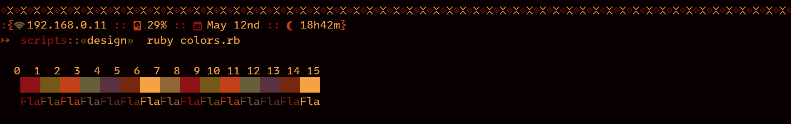

# Flamerial

## Starting Point

The Flamerial project is a theme with a palette forged with power and flames,
that you can use whenever you want to feel imperious.

Here is a preview that you can check out.

## Palette

| Name            | Syntax Highlight | Ansi | Hex     | Preview                                |
| --------------- | ---------------- | ---- | ------- | -------------------------------------- |
| black           | Background       | 0    | #0d0807 |            |
| black_variant_0 | Background       | None | #261815 |  |
| black_variant_1 | Background       | None | #402722 |  |
| black_variant_2 | Background       | None | #593730 |  |
| red             | Values           | 1    | #8a4033 |              |
| green           | Variables        | 2    | #8f764f |            |
| yellow          | Functions        | 3    | #85695d |           |
| blue            | None             | 4    | #918686 |             |
| magenta         | Macros           | 5    | #85444c |          |
| cyan            | Statements       | 6    | #8f5519 |             |
| white           | Foreground       | 7    | #c2bcb2 |            |
| light_black     | Comments         | 8    | #918686 |      |

## Installation

In this repository, you will find all the ports of the Flamerial theme that
do not have any special specification, such as: the ones for terminal emulators.

All the ports can be find under the `ports` directory and manuals explaining how
to install each port can be find under the `manuals` directory.

For more ports, there are other repositories that contains related content:

-   [`flamerial.nvim`](https://github.com/skippyr/flamerial.nvim): the port of
    the theme for Vim/Neovim.

## Issues And Contributions

Learn how to report issues and contribute to this project by reading its
[contributions guidelines](https://skippyr.github.io/materials/pages/contributions_guidelines.html).

## License

This project is released under the terms of the MIT license. A copy of the
license is bundled with the source code.

Copyright (c) 2023, Sherman Rofeman. MIT license.
