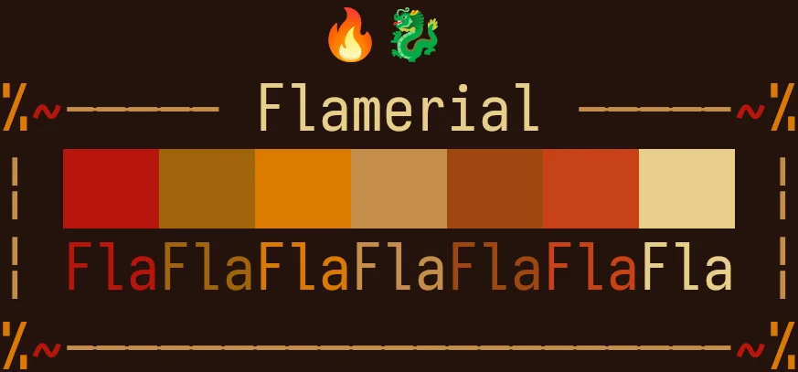

  

<h1 align="center">≥v≥v&ensp;flamerial&ensp;≥v≥v</h1>

  
  &nbsp;
  
  &nbsp;
  
  &nbsp;
  

## ❡ About

A fiery and spice terminal theme.

  
  
<strong>Caption:</strong> a preview showing Flamerial applied on a terminal. The font used is <a href="https://www.nerdfonts.com/font-downloads">Hack</a> (Nerd Fonts patched).

## ❡ Install

Available ports are under the `ports` directory. Access it, find one you would like to install, then read the `README.md` inside of it for instructions.

## ❡ Pallete

<table align="center">
  <thead>
    <tr>
      <th>Preview</th>
      <th>ANSI</th>
      <th>Name</th>
      <th>HEX</th>
    </tr>
  </thead>
  <tbody>
    <tr>
      <td></td>
      <td>0</td>
      <td>Black</td>
      <td>`#221107`</td>
    </tr>
    <tr>
      <td></td>
      <td>1</td>
      <td>Red</td>
      <td>`#990b3a`</td>
    </tr>
    <tr>
      <td></td>
      <td>2</td>
      <td>Green</td>
      <td>`#cc561b`</td>
    </tr>
    <tr>
      <td></td>
      <td>3</td>
      <td>Yellow</td>
      <td>`#e0a100`</td>
    </tr>
    <tr>
      <td></td>
      <td>4</td>
      <td>Blue</td>
      <td>`#b98361`</td>
    </tr>
    <tr>
      <td></td>
      <td>5</td>
      <td>Magenta</td>
      <td>`#ae3a34`</td>
    </tr>
    <tr>
      <td></td>
      <td>6</td>
      <td>Cyan</td>
      <td>`#a16205`</td>
    </tr>
    <tr>
      <td></td>
      <td>7</td>
      <td>White</td>
      <td>`#f5efcd`</td>
    </tr>
  </tbody>
</table>

<strong>Caption:</strong> the colors used in the flamerial color scheme with their respective ANSI values.

## ❡ Help

If you need help related to this project, open a new issue in its [issues page](https://github.com/skippyr/flamerial/issues) or send me an [e-mail](mailto:skippyr.developer@gmail.com) describing what is going on.

## ❡ Contributing

This project is open to review and possibly accept contributions, specially fixes and suggestions. If you are interested, send your contribution to its [pull requests page](https://github.com/skippyr/flamerial/pulls) or to my [e-mail](mailto:skippyr.developer@gmail.com).

By contributing to this project, you must agree to license your work under the same license that the project uses.

## ❡ License

This is free software licensed under the MIT License that comes WITH NO WARRANTY. Refer to the `LICENSE` file that comes in its source code for license and copyright details.

&ensp;

<strong>≥v≥v&ensp;Here Be Dragons!&ensp;≥v≥</strong> Made with love by skippyr <3

