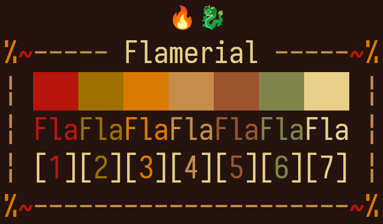

<h1 align="center">flamerial</h1>

  
  
  
  

## About

A fiery terminal dark theme to bring some good vibes to your days. Designed as a combination of 4 chromatic and 4 neutral colors, it has a decent balance between usability and an unalike experience.

<strong>Caption:</strong> a preview of the flamerial theme applied on a terminal. The font used is <a href="https://github.com/be5invis/Iosevka">Iosevka SS08</a>.

## Install

All available ports of the theme are under the ports directory. Open one you would like to apply, then read the README inside it to find out how to install it.

## Palette

<table align="center">
  <thead>
    <tr>
      <th>ANSI</th>
      <th>Name</th>
      <th>HEX</th>
    </tr>
  </thead>
  <tbody>
    <tr>
      <td>0</td>
      <td>Black</td>
      <td>#24130e</td>
    </tr>
    <tr>
      <td>1</td>
      <td>Red</td>
      <td>#b8150d</td>
    </tr>
    <tr>
      <td>2</td>
      <td>Green</td>
      <td>#9e7100</td>
    </tr>
    <tr>
      <td>3</td>
      <td>Yellow</td>
      <td>#db7a00</td>
    </tr>
    <tr>
      <td>4</td>
      <td>Blue</td>
      <td>#c48d49</td>
    </tr>
    <tr>
      <td>5</td>
      <td>Magenta</td>
      <td>#9c542d</td>
    </tr>
    <tr>
      <td>6</td>
      <td>Cyan</td>
      <td>#80854b</td>
    </tr>
    <tr>
      <td>7</td>
      <td>White</td>
      <td>#e8cf89</td>
    </tr>
  </tbody>
</table>

<strong>Caption:</strong> the flamerial palette with their
respective ANSI values.

## Help

If you need help about this project, open a new issue in its [issues page](https://github.com/skippyr/flamerial/issues) or send me an [e-mail](mailto:skippyr.developer@gmail.com) describing what is going on.

## Contributing

This project is open to review and possibly accept contributions, specially fixes and suggestions. If you are interested, send your contribution to its [pull requests page](https://github.com/skippyr/flamerial/pulls) or to my [e-mail](mailto:skippyr.developer@gmail.com).

By contributing to this project, you must agree to license your work under the same license that the project uses.

## License

This project is licensed under the MIT License. Refer to the LICENSE file that comes in its source code for license and copyright details.
