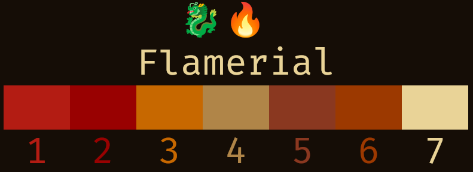
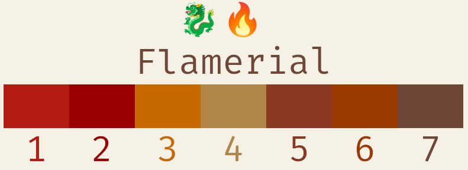

# Flamerial
## About
This repository contains ports of the Flamerial theme for terminal emulators,
that is an 8-colors theme with a flameish palette: containing variations with
both intense (dark) and soft combination (light) of red and yellow.

Here are some previews that you can check it out:

## Palette
Here is a table containing all the colors used in the theme.

| Name          | Preview                            | ANSI       | Hex       |
| ------------- | ---------------------------------- | ---------- | --------- |
| Black (dark)  |   | `0`        | `#150d06` |
| Black (light) |  | `0`        | `#f5f1e5` |
| Red           |          | `1`        | `#b31c13` |
| Green         |        | `2`        | `#990101` |
| Yellow        |       | `3`        | `#c76800` |
| Blue          |         | `4`        | `#b08548` |
| Magenta       |      | `5`        | `#8a3820` |
| Cyan          |         | `6`        | `#9c3900` |
| White (dark)  |   | `7`        | `#e9d397` |
| White (light) |  | `7`        | `#704637` |

## Issues And Contributions
You can use its [issues page](https://github.com/skippyr/flamerial/issues) to
provide your feedback, to report any issue you are facing or to ask for help.

You can also fork it and send pull requests to be reviewed.

All kinds of contributions, from people of any skill level, is always
appreciated.

## Copyright
This software is under the MIT license. A copy of the license is bundled with
the source code.
