

  

<h1 align="center">≥v≥v&ensp;Flamerial&ensp;≥v≥v</h1>

  
  &nbsp;
  
  &nbsp;
  
  &nbsp;
  

  
  
  

  <a href="https://github.com/skippyr/flamerial/blob/master/README.md">🇺🇸 English-US</a>
  &ensp;
  <a href="https://github.com/skippyr/flamerial/blob/master/README_pt-BR.md">🇧🇷 Portuguese-BR</a>

## ❡ About
A fiery and spice tribal terminal theme crafted to ignite your creativity. It is available for apps on Windows, macOS and Linux.

  

<strong>Caption:</strong> a preview of the Flamerial palette. Font is <a href="https://www.monolisa.dev">Monolisa</a>.

## ❡ Screenshots
Check out how the palette looks like applied in a variety of situations:

  

    
Click to expand (...)

    

      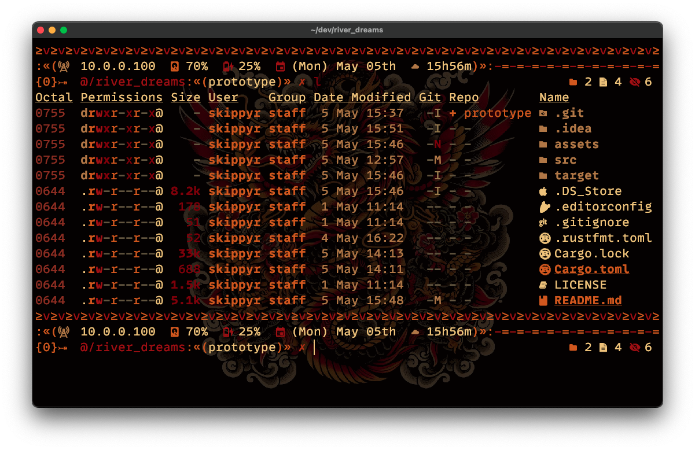
    

    
<strong>Caption:</strong> a preview of the Flamerial palette being used while running <a href="https://github.com/eza-community/eza">eza</a> in <a href="https://github.com/kovidgoyal/kitty">Kitty</a> on macOS. Shell theme is <a href="https://github.com/skippyr/river_dreams">River Dreams</a> and font is <a href="https://www.monolisa.dev">Monolisa</a> (with fallback to <a href="https://github.com/ryanoasis/nerd-fonts">Symbols Nerd Font</a>). Background is AI art and provided as an wallpaper port.

    

      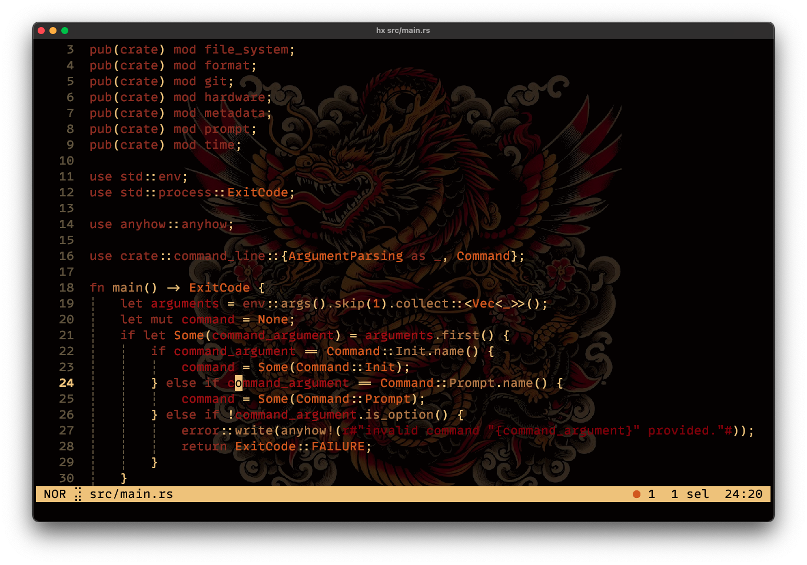
    

    
<strong>Caption:</strong> a preview of the Flamerial palette being used while running <a href="https://github.com/helix-editor/helix">helix</a> (using the <code>base16_default</code> theme) in <a href="https://github.com/kovidgoyal/kitty">Kitty</a> on macOS. Font is <a href="https://www.monolisa.dev">Monolisa</a> (with fallback to <a href="https://github.com/ryanoasis/nerd-fonts">Symbols Nerd Font</a>). Background is AI art and provided as an wallpaper port.

    

      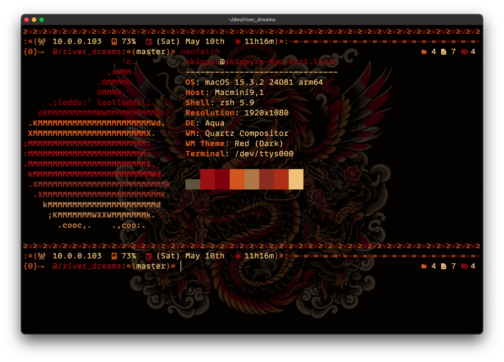
    

    
<strong>Caption:</strong> a preview of the Flamerial palette being used while running <a href="https://github.com/dylanaraps/neofetch">neofetch</a> in <a href="https://github.com/kovidgoyal/kitty">Kitty</a> on macOS. Shell theme is <a href="https://github.com/skippyr/river_dreams">River Dreams</a> and font is <a href="https://www.monolisa.dev">Monolisa</a> (with fallback to <a href="https://github.com/ryanoasis/nerd-fonts">Symbols Nerd Font</a>). Background is AI art and provided as an wallpaper port.

    

      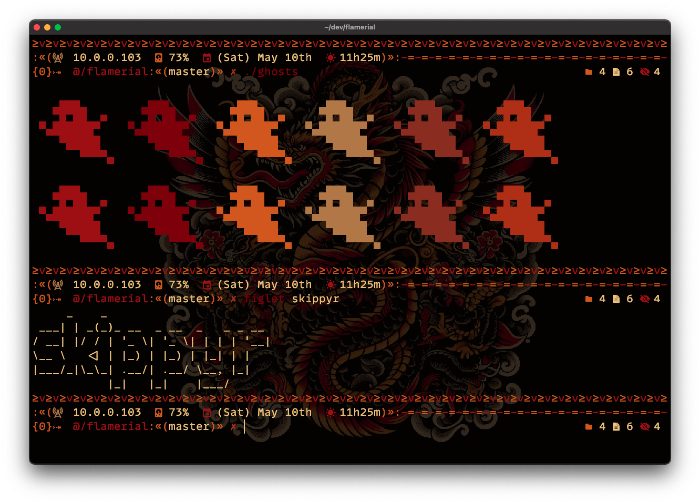
    

    
<strong>Caption:</strong> a preview of the Flamerial palette being used while running the <a href="https://github.com/stark/Color-Scripts/blob/master/color-scripts/ghosts">ghosts</a> color script and <a href="http://www.figlet.org">figlet</a> in <a href="https://github.com/kovidgoyal/kitty">Kitty</a> on macOS. Shell theme is <a href="https://github.com/skippyr/river_dreams">River Dreams</a> and font is <a href="https://www.monolisa.dev">Monolisa</a> (with fallback to <a href="https://github.com/ryanoasis/nerd-fonts">Symbols Nerd Font</a>). Background is AI art and provided as an wallpaper port.

  

## ❡ Install
### Procedures
All available ports are at the `ports` directory. Access one you would like to apply the theme on, then read the `README.md` inside it for installation instructions.

## ❡ Palette
The theme is composed by the following colors:

<table align="center">
  <thead>
    <tr>
      <th>Preview</th>
      <th>Name</th>
      <th>HEX</th>
      <th>RGB</th>
    </tr>
  </thead>
  <tbody>
    <tr>
      <td></td>
      <td>Black</td>
      <td><code>#030101</code></td>
      <td><code>(r: 3, g: 1, b: 1)</code></td>
    </tr>
    <tr>
      <td></td>
      <td>Red</td>
      <td><code>#991f06</code></td>
      <td><code>(r: 153, g: 31, b: 6)</code></td>
    </tr>
    <tr>
      <td>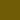</td>
      <td>Green</td>
      <td><code>#7d0800</code></td>
      <td><code>(r: 125, g: 8, b: 0)</code></td>
    </tr>
    <tr>
      <td>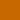</td>
      <td>Yellow</td>
      <td><code>#c76800</code></td>
      <td><code>(r: 199, g: 104, b: 0)</code></td>
    </tr>
    <tr>
      <td></td>
      <td>Blue</td>
      <td><code>#b08548</code></td>
      <td><code>(r: 176, g: 133, b: 72)</code></td>
    </tr>
    <tr>
      <td></td>
      <td>Magenta</td>
      <td><code>#8a3820</code></td>
      <td><code>(r: 138, g: 56, b: 32)</code></td>
    </tr>
    <tr>
      <td></td>
      <td>Cyan</td>
      <td><code>#a83e00</code></td>
      <td><code>(r: 168, g: 62, b: 0)</code></td>
    </tr>
    <tr>
      <td>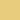</td>
      <td>White</td>
      <td><code>#e8cc7d</code></td>
      <td><code>(r: 232, g: 204, b: 125)</code></td>
    </tr>
    <tr>
      <td>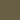</td>
      <td>Gray</td>
      <td><code>#695f44</code></td>
      <td><code>(r: 105, g: 95, b: 68)</code></td>
    </tr>
    <tr>
      <td>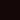</td>
      <td>Alternate Background 0</td>
      <td><code>#140707</code></td>
      <td><code>(r: 20, g: 7, b: 7)</code></td>
    </tr>
    <tr>
      <td></td>
      <td>Alternate Background 1</td>
      <td><code>#1f0a0a</code></td>
      <td><code>(r: 31, g: 10, b: 10)</code></td>
    </tr>
    <tr>
      <td>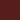</td>
      <td>Selection Background</td>
      <td><code>#571d1d</code></td>
      <td><code>(r: 87, g: 29, b: 29)</code></td>
    </tr>
    <tr>
      <td>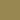</td>
      <td>Cursor Selection</td>
      <td><code>#968451</code></td>
      <td><code>(r: 150, g: 132, b: 81)</code></td>
    </tr>
    <tr>
      <td>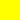</td>
      <td>Matching Items</td>
      <td><code>#ffff00</code></td>
      <td><code>(r: 255, g: 255, b: 0)</code></td>
    </tr>
  </tbody>
</table>

<strong>Caption:</strong> the colors that compose the theme palette.

## ❡ Help
If you need help related to this project, open a new issue in its [issues pages](https://github.com/skippyr/flamerial/issues) or send an [e-mail](mailto:skippyr.developer@icloud.com) describing what is going on.

## ❡ Contributing
This project is open to review and possibly accept contributions in the form of bug reports and suggestions. If you are interested, send your contribution to its [pull requests page](https://github.com/skippyr/flamerial/pulls) or via [e-mail](mailto:skippyr.developer@icloud.com).

## ❡ License
This is free software licensed under the BSD-3-Clause License that comes WITH NO WARRANTY. Refer to the `LICENSE` file that comes in its source code for license and copyright details.

&ensp;

– 🐉❤️‍🔥 – <strong>≥v≥v&ensp;Here Be Dragons!&ensp;≥v≥</strong> Made with love by 🍒 <a href="https://github.com/skippyr">skippyr</a>

