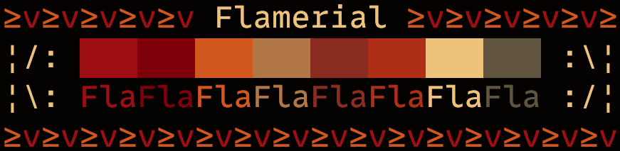

# Flamerial
## About
A fiery and spice terminal theme crafted to ignite your creativity. It is available for apps on macOS, Linux and Windows.

## Install
### Procedures
All available ports are at the `Ports` directory. Access one you would like to apply the theme on, then read the `README.md` inside it for installation instructions.

## Palette
The theme is composed by the following colors:

| Preview | Name | Hex | RGB |
| - | - | - | - |
|  | Black | `#030101` | r: `3`, g: `1`, b: `1` |
|  | Red | `#991F06` | r: `153`, g: `31`, b: `6` |
|  | Green | `#7D0800` | r: `125`, g: `8`, b: `0` |
|  | Yellow | `#C76800` | r: `199`, g: `104`, b: `0` |
|  | Blue | `#B08548` | r: `176`, g: `133`, b: `72` |
|  | Magenta | `#8A3820` | r: `138`, g: `56`, b: `32` |
|  | Cyan | `#A83E00` | r: `168`, g: `62`, b: `0` |
|  | White | `#E8CC7D` | r: `232`, g: `204`, b: `125` |
|  | Gray | `#695F44` | r: `105`, g: `95`, b: `68` |

## Help
If you need help related to this project, open a new issue in its [issues pages](https://gitlab.com/skippyr/Flamerial/issues) or send an [e-mail](mailto:skippyr.developer@icloud.com) describing what is going on.

## Contributing
This project is open to review and possibly accept contributions in the form of bug reports and suggestions. If you are interested, send your contribution to its [merge requests](https://gitlab.com/skippyr/Flamerial/merge_requests) page or via [e-mail](mailto:skippyr.developer@icloud.com).

## Copyright
This is free software licensed under the BSD 3-Clause License that comes WITH NO WARRANTY. Refer to the `LICENSE` file that comes in its source code for license and copyright details.
