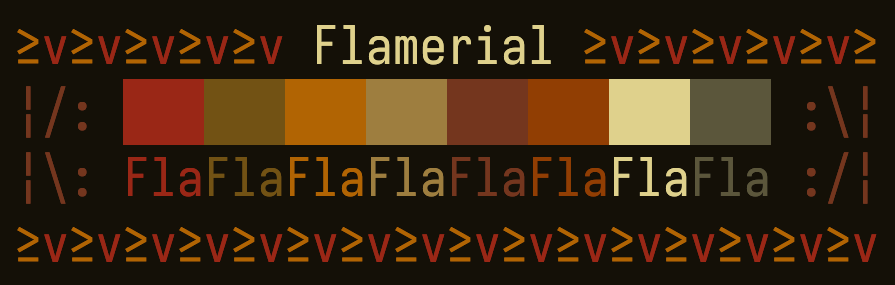

  

<h1 align="center">≥v≥v&ensp;Flamerial&ensp;≥v≥v</h1>

## ❡ About

A fiery and spice theme available on Windows, Linux and MacOS.

  
  
<strong>Caption:</strong> the Flamerial theme applied on a terminal.

## ❡ Install

Available ports are under the `ports` directory. Access it, find one you would like to install, then read the `README.md` inside of it for instructions.

## ❡ Pallete

<table align="center">
  <thead>
    <tr>
      <th>Preview</th>
      <th>ANSI</th>
      <th>Name</th>
      <th>HEX</th>
      <th>RGB</th>
    </tr>
  </thead>
  <tbody>
    <tr>
      <td></td>
      <td>0</td>
      <td>Black</td>
      <td><code>#150d06</code></td>
      <td><code>21</code> <code>13</code> <code>6</code></td>
    </tr>
    <tr>
      <td></td>
      <td>1</td>
      <td>Red</td>
      <td><code>#b31c13</code></td>
      <td><code>179</code> <code>29</code> <code>19</code></td>
    </tr>
    <tr>
      <td></td>
      <td>2</td>
      <td>Green</td>
      <td><code>#990101</code></td>
      <td><code>153</code> <code>1</code> <code>1</code></td>
    </tr>
    <tr>
      <td></td>
      <td>Yellow</td>
      <td>3</td>
      <td><code>#c76800</code></td>
      <td><code>199</code> <code>104</code> <code>0</code></td>
    </tr>
    <tr>
      <td></td>
      <td>4</td>
      <td>Blue</td>
      <td><code>#b08548</code></td>
      <td><code>176</code> <code>133</code> <code>72</code></td>
    </tr>
    <tr>
      <td></td>
      <td>5</td>
      <td>Magenta</td>
      <td><code>#8a3820</code></td>
      <td><code>138</code> <code>56</code> <code>32</code></td>
    </tr>
    <tr>
      <td></td>
      <td>6</td>
      <td>Cyan</td>
      <td><code>#9c3900</code></td>
      <td><code>156</code> <code>57</code> <code>0</code></td>
    </tr>
    <tr>
      <td></td>
      <td>7</td>
      <td>White</td>
      <td><code>#e9d397</code></td>
      <td><code>233</code> <code>211</code> <code>151</code></td>
    </tr>
  </tbody>
</table>

<strong>Caption:</strong> the colors of the Flamerial theme with their respective ANSI codes.

## ❡ Help

If you need help related to this project, open a new issue in its [issues page](https://github.com/skippyr/flamerial/issues) or send me an [e-mail](mailto:skippyr.developer@icloud.com) describing what is going on.

## ❡ Contributing

This project is open to review and possibly accept contributions, specially fixes and suggestions. If you are interested, send your contribution to its [pull requests page](https://github.com/skippyr/flamerial/pulls) or to my [e-mail](mailto:skippyr.developer@icloud.com).

By contributing to this project, you must agree to license your work under the same license that the project uses.

## ❡ License

This is free software licensed under the MIT License that comes WITH NO WARRANTY. Refer to the `LICENSE` file that comes in its source code for license and copyright details.

&ensp;

<strong>≥v≥v&ensp;Here Be Dragons!&ensp;≥v≥</strong> Made with love by skippyr <3

