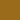

# Flamerial

## Starting Point

The Flamerial project is a dark theme with an aged palette. It was inspired
by the [Gruvbox](https://github.com/morhetz/gruvbox) theme.

## Palette

| Name        | ANSI | Hex     | Preview                  |
| ----------- | ---- | ------- | ------------------------ |
| black       | 0    | #241a12 |  |
| red         | 1    | #a62929 |  |
| green       | 2    | #9a6b1b |  |
| yellow      | 3    | #d97904 |  |
| blue        | 4    | #a59a78 |  |
| magenta     | 5    | #b3374a |  |
| cyan        | 6    | #c2421f |  |
| white       | 7    | #e6d0bb |  |
| light_black | 8    | #c78e59 |  |

## Installation

In this repository, you will find all the ports of the Flamerial theme that
do not have any special specification, such as: the ones for terminal emulators.

All the ports can be find under the `ports` directory and manuals explaining how
to install each port can be find under the `manuals` directory.

There are some wallpapers, described in the `wallpapers/wallpaper.md` file, that
you can download to match with the theme.

For more ports, there are other repositories that contains related content:

-   [`flamerial.nvim`](https://github.com/skippyr/flamerial.nvim): the port of
    the theme for Vim/Neovim.

## Issues And Contributions

Learn how to report issues and contribute to this project by reading its
[contributions guidelines](https://skippyr.github.io/materials/pages/contributions_guidelines.html).

## License

This project is released under the terms of the MIT license. A copy of the
license is bundled with the source code.

Copyright (c) 2023, Sherman Rofeman. MIT license.
