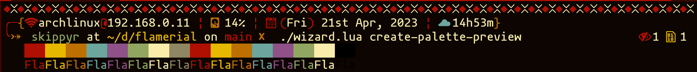
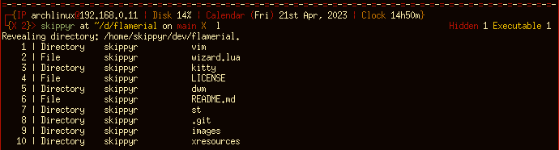
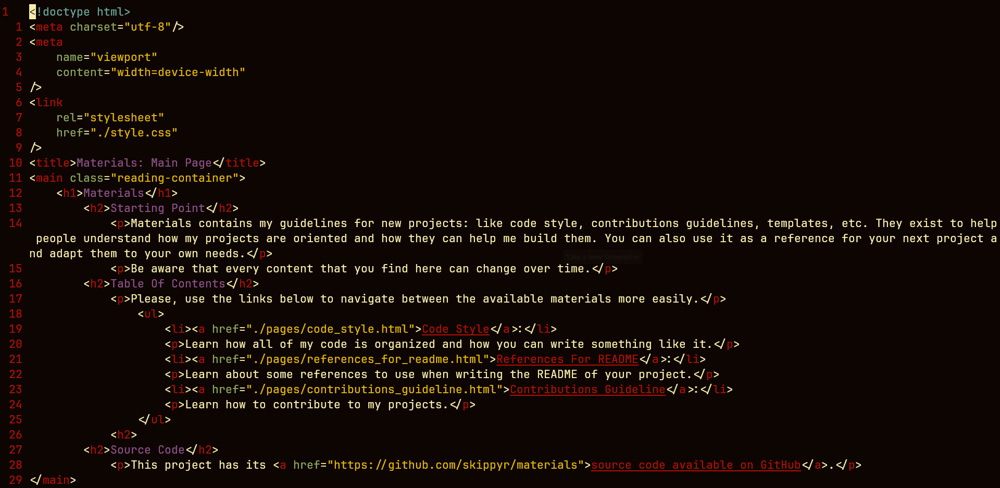
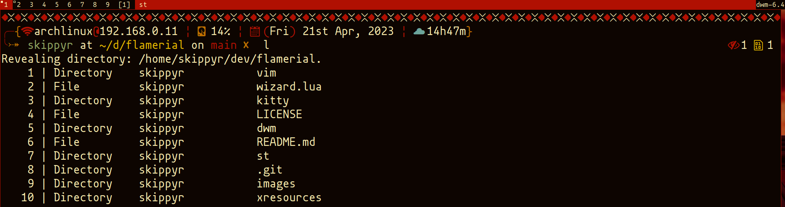

<h1>Flamerial</h1>
	<h2>Starting Point</h2>
		
Flamerial is a low contrast dark color palette with an old feeling. It is available for a few softwares.

		
		
It is heavily inspired by these other amazing color palettes:

			<ul>
				<li><a href="https://github.com/morhetz/gruvbox">Gruvbox Dark</a></li>
				<li>Twilight</li>
				<li>Solarized Dark</li>
				<li><a href="https://github.com/rose-pine">Rosé Pine Dark</a></li>
				<li><a href="https://github.com/metalelf0/base16-black-metal-scheme">Black Metal</a></li>
			</ul>
		
If was not for them to exist, probably Flamerial would not be here.

	<h2>Palette</h2>
		<table>
			<thead>
				<tr>
					<td>Name</td>
					<td>Hex</td>
					<td>Preview</td>
				</tr>
			</thead>
			<tbody>
				<tr>
					<td>black</td>
					<td>#0d0501</td>
					<td></td>
				</tr>
				<tr>
					<td>red</td>
					<td>#b01002</td>
					<td></td>
				</tr>
				<tr>
					<td>green</td>
					<td>#e6b800</td>
					<td></td>
				</tr>
				<tr>
					<td>yellow</td>
					<td>#bd6f00</td>
					<td></td>
				</tr>
				<tr>
					<td>blue</td>
					<td>#6ca69c</td>
					<td></td>
				</tr>
				<tr>
					<td>magenta</td>
					<td>#8f5187</td>
					<td></td>
				</tr>
				<tr>
					<td>cyan</td>
					<td>#91a761</td>
					<td></td>
				</tr>
				<tr>
					<td>white</td>
					<td>#faedac</td>
					<td></td>
				</tr>
				<tr>
					<td>light_black</td>
					<td>#8f8763</td>
					<td></td>
				</tr>
			</tbody>
		</table>
	<h2>Installation And Usage</h2>
		
For any installation, start by following these steps:

		<ul>
			<li>Download this repository to your machine:</li>
			
If you have <code>git</code> installed, you can use it in the following command:

			<pre><code>git clone --depth 1 https://github.com/skippyr/flamerial</code></pre>
			
This will clone this repository to a directory called <code>flamerial</code> in your current directory. Feel free to change to whatever directory you want by adding the desired path in the end of that command.

			
If you do not have <code>git</code> installed, you can download a ZIP file containing the repository through its page on GitHub. Access it, click on the <code>Code</code> button on the top of the page, then on <code>Download ZIP</code>. After downloading, you just have to unzip it and move it to whatever directory you desire.

			<li>Access the repository's directory.</li>
			
Now, follow the instructions to install it for your desired software.

		</ul>
		<h3>Kitty</h3>
			
			<ul>
				<li>Copy the file <code>kitty/flamerial.conf</code> to the directory <code>~/.config/kitty/themes</code>. You may have to create that directory first.</li>
				<pre><code>mkdir -p ~/.config/kitty/themes</code></pre>
				<pre><code>mv ./kitty/flamerial.conf ~/.config/kitty/themes</code></pre>
				<li>If your version of Kitty has the <code>themes</code> kitten, you can apply the port using it. Just navigate to the <code>User</code> tab and apply it.</li>
				<pre><code>kitty +kitten themes</code></pre>
				<li>If your version of Kitty does not have it or you could not run it, you can apply the port manually by adding an include rule in the file <code>~/.config/kitty/kitty.conf</code>.</li>
				<pre><code>include ./themes/flamerial.conf</code></pre>
				
If you have used other color palettes in Kitty, you may have to comment or remove include rules inside that file that may be including other color palettes.

				<li>Reset your Kitty's session.</li>
			</ul>
		<h3>Xresources</h3>
			
			<ul>
				<li>Use the X11 command <code>xrdb</code> to update X11's database with the colors that are in the file <code>xresources/flamerial.xrdb</code>.</li>
				<pre><code>xrdb -merge ./xresources/flamerial.xrdb</code></pre>
				
The flag <code>-merge</code> specifies to X11 that you only want to merge those changes instead of replacing all of your current X11's settings.

				<li>Restart your X11 applications.</li>
				
Be aware that those changes are not persistent and will get reversed when you log back into the graphical environment. To make them persistent, you must use the same command as stated before in a script that is execute everytime you enter the graphical environment, like <code>~/.xinitrc</code>, for example. If that is your case, remember to use the full path to the file instead.

			</ul>
		<h3>Vim<h3>
			
			<ul>
				<li>Copy the file <code>vim/flamerial.vim</code> to <code>~/.vim/colors</code>. You may have to create that directory first.</li>
				<pre><code>mkdir -p ~/.vim/colors</code></pre>
				<pre><code>mv ./vim/flamerial.vim ~/.vim/colors</code></pre>
				<li>Apply the port by adding a <code>colorscheme</code> rule in your configuration file, <code>~/.vimrc</code>.</li>
				<pre><code>colorscheme flamerial</code></pre>
			</ul>
		<h3>Dwm And St</h3>
			
			<ul>
				<li>Replace the variable definitions of your <code>config.def.h</code> by the ones that you find in the files <code>dwm/dwm.c</code> for dwm and <code>st/st.c</code> for st.</li>
				<li>Remove the file <code>config.h</code> of your source files as it may contain previous configurations.</li>
				<pre><code>rm -f config.h</code></pre>
				<li>Recompile and install the source files:</li>
				<pre><code>sudo make clean install</code></pre>
			</ul>
	<h2>Issues And Contributions</h2>
		
Learn how to report issues, questions and ideas and how to contribute to this project by reading its <a href="https://skippyr.github.io/materials/pages/contributions_guideline.html">contributions guideline</a>.

	<h2>License</h2>
		
Flamerial is released under the MIT License. You can refer to the license as the file <code><a href="https://github.com/skippyr/flamerial/blob/main/LICENSE">LICENSE</a></code> in the root directory of this repository.

		
Copyright (c) 2023, Sherman Rofeman. MIT License.

