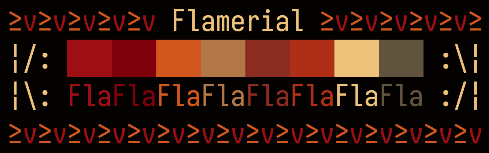
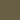
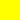

    

<h1 align="center">≥v≥v&ensp;Flamerial&ensp;≥v≥v</h1>

    
    &nbsp;
    
    &nbsp;
    
    &nbsp;
    

## ❡ About
A fiery-spice theme to ignite your creativity. It is available for macOS, Linux and Windows.

    

<strong>Caption:</strong> a preview of the Flamerial palette.

## ❡ Install
### Procedures
All available ports are at the `ports` directory. Access one you would like to apply the theme on, then read the `README.md` inside it for installation instructions.

## ❡ Palette
The theme is composed by the following colors:

<table align="center">
    <thead>
        <tr>
            <th>Preview</th>
            <th>Name</th>
            <th>Hex</th>
        </tr>
    </thead>
    <tbody>
        <tr>
            <td></td>
            <td>Black</td>
            <td><code>#030101</code></td>
        </tr>
        <tr>
            <td></td>
            <td>Red</td>
            <td><code>#991f06</code></td>
        </tr>
        <tr>
            <td></td>
            <td>Green</td>
            <td><code>#7d0800</code></td>
        </tr>
        <tr>
            <td></td>
            <td>Yellow</td>
            <td><code>#c76800</code></td>
        </tr>
        <tr>
            <td></td>
            <td>Blue</td>
            <td><code>#b08548</code></td>
        </tr>
        <tr>
            <td></td>
            <td>Magenta</td>
            <td><code>#8a3820</code></td>
        </tr>
        <tr>
            <td></td>
            <td>Cyan</td>
            <td><code>#a83e00</code></td>
        </tr>
        <tr>
            <td></td>
            <td>White</td>
            <td><code>#e8cc7d</code></td>
        </tr>
        <tr>
            <td></td>
            <td>Light Black</td>
            <td><code>#695f44</code></td>
        </tr>
        <tr>
            <td></td>
            <td>Selection</td>
            <td><code>#968451</code></td>
        </tr>
        <tr>
            <td></td>
            <td>Alternate Background</td>
            <td><code>#140707</code></td>
        </tr>
        <tr>
            <td>
            <td>Selection Background</td>
            <td><code>#571d1d</code></td>
        </tr>
        <tr>
            <td></td>
            <td>Current Line</td>
            <td><code>#1f0a0a</code></td>
        </tr>
        <tr>
            <td></td>
            <td>Matching Group</td>
            <td><code>#ffff00</code></td>
        </tr>
    </tbody>
</table>

<strong>Caption:</strong> the colors that compose the theme palette.

## ❡ Help
If you need help related to this project, open a new issue in its [issues pages](https://github.com/skippyr/flamerial/issues) or send an [e-mail](mailto:skippyr.developer@icloud.com) describing what is going on.

## ❡ Contributing
This project is open to review and possibly accept contributions in the form of bug reports and suggestions. If you are interested, send your contribution to its [pull requests page](https://github.com/skippyr/flamerial/pulls) or via [e-mail](mailto:skippyr.developer@icloud.com).

## ❡ License
This is free software licensed under the BSD-3-Clause License that comes WITH NO WARRANTY. Refer to the `LICENSE` file that comes in its source code for license and copyright details.
