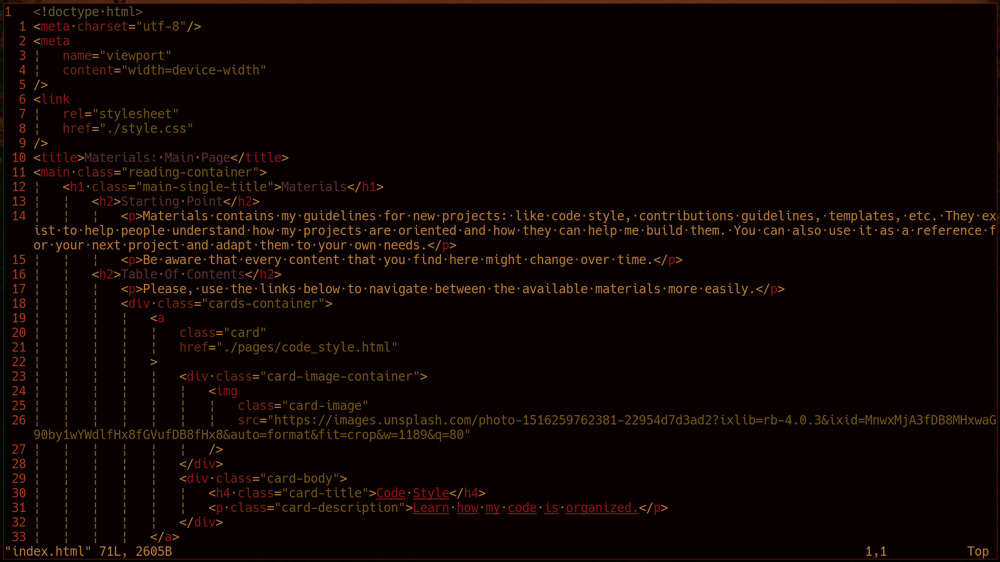

<h1>Flamerial</h1>
	<h2>Starting Point</h2>
		
An extremely low contrast theme that gives retro and cozy feelings.

		
		
		
In the images, Flamerial was used on the <a href="https://github.com/kovidgoyal/kitty">Kitty</a> terminal emulator with the <a href="https://github.com/skippyr/river_dreams">River Dreams</a> ZSH theme and <a href="https://github.com/be5invis/Iosevka">Iosevka</a> font.

		<table>
			<thead>
				<tr>
					<td>Name</td>
					<td>Ansi</td>
					<td>Hex</td>
					<td>Preview</td>
				</tr>
			</thead>
			<tbody>
				<tr>
					<td>Black</td>
					<td>0</td>
					<td>#080000</td>
					<td></td>
				</tr>
				<tr>
					<td>Black (Variant 0)</td>
					<td>None</td>
					<td>#260b0b</td>
					<td></td>
				</tr>
				<tr>
					<td>Black (Variant 1)</td>
					<td>None</td>
					<td>#260b0b</td>
					<td></td>
				</tr>
				<tr>
					<td>Red</td>
					<td>1</td>
					<td>#911317</td>
					<td></td>
				</tr>
				<tr>
					<td>Green</td>
					<td>2</td>
					<td>#755717</td>
					<td></td>
				</tr>
				<tr>
					<td>Yellow</td>
					<td>3</td>
					<td>#c24119</td>
					<td></td>
				</tr>
				<tr>
					<td>Blue</td>
					<td>4</td>
					<td>#665f39</td>
					<td></td>
				</tr>
				<tr>
					<td>Magenta</td>
					<td>5</td>
					<td>#59303d</td>
					<td></td>
				</tr>
				<tr>
					<td>Cyan</td>
					<td>6</td>
					<td>#75280e</td>
					<td></td>
				</tr>
				<tr>
					<td>White</td>
					<td>7</td>
					<td>#f5a245</td>
					<td></td>
				</tr>
				<tr>
					<td>Light Black</td>
					<td>8</td>
					<td>#916634</td>
					<td></td>
				</tr>
			</tbody>
		</table>
	<h2>Installation And Usage</h2>
		
For any installation, you must first download this repository.

		
If you have <code>git</code> installed, you can use the following command:

		<pre><code>git clone --depth=1 https://github.com/skippyr/flamerial</code></pre>
		
If you do not have <code>git</code> installed, you can download it from its page on GitHub: access that page, then click on the button labeled <code>Code</code> on the top of the page, then click on the button labeled <code>Download ZIP</code> that will appear in the floating menu. This will download a compressed file with the repository, you just have to unzip it in a formidable directory.

		<h3>Kitty</h3>
			<ul>
				<li>Access the repository's directory.</li>
					<pre><code>cd flamerial</code></pre>
				<li>Copy the theme file <code>kitty/flamerial.conf</code> to the directory <code>~/.config/kitty/themes</code>.</li>
					<pre><code>
mkdir -p ~/.config/kitty/themes
mv ./kitty/flamerial.conf ~/.config/kitty/themes
					</code></pre>
				<li>If your version of Kitty has the <code>themes</code> kitten, you can apply the theme using it. Just navigate to the <code>User</code> tab and apply it.</li>
					<pre><code>kitty +kitten themes</code></pre>
				<li>If your version of Kitty does not have it or you could not run it, you can apply the port manually by adding an include rule in the file <code>~/.config/kitty/kitty.conf</code>.</li>
					<pre><code>include ./themes/flamerial.conf</code></pre>
					
If you have used other color palettes in Kitty, you may have to comment or remove include rules inside that file that may be including other color palettes.

					<li>Reset your Kitty's session.</li>
			</ul>
		<h3>Xresources</h3>
			<ul>
				<li>Access the repository's directory.</li>
					<pre><code>cd flamerial</code></pre>
				<li>Use the X11 util <code>xrdb</code> to update X11's database with the Flamerial colors from the file <code>xresources/flamerial.xrdb</code>.</li>
					<pre><code>xrdb -merge xresources/flamerial.xrdb</code></pre>
				<li>Restart your X11 applications.</li>
					
The <code>-merge</code> flag identifies to <code>xrdb</code> that you want to merge the colors into the database, instead of replacing all your current settings.

					
These changes are not persistents and will be reverted if you restart X11. To make them persistent, include that same command in a script that is executed every time you enter the graphical server. X11, for example, allows you to do that by using the <code>~/.xinitrc</code> file but there are other ways too.

					
If you are going to do it, just remember to replace the relative path by the absolute path of the theme file, in the command, otherwise it will not be found.

			</ul>
		<h3>Vim</h3>
			<ul>
				<li>Access the repository's directory.</li>
					<pre><code>cd flamerial</code></pre>
				<li>Copy the file <code>vim/flamerial.vim</code> to <code>~/.vim/colors</code>.</li>
					<pre><code>
mkdir -p ~/.vim/colors
cp vim/flamerial.vim ~/.vim/colors
					</code></pre>
				<li>Apply the colorscheme in the file <code>~/.vimrc</code> using the <code>colorscheme</code> rule.</li>
					<pre><code>colorscheme flamerial</code></pre>
				<li>Restart vim.</li>
			</ul>
		<h3>Wallpapers</h3>
			
I have separated some URLS from where you can get free to use wallpapers that match really well with Flamerial at <code>wallpapers/wallpapers.md</code>. All credits will go to their respective authors, which you can then support by downloading the wallpapers directly from their sources.

	<h2>Issues And Contributions</h2>
		
Learn how to report issues, questions and ideas and how to contribute to this project by reading its <a href="https://skippyr.github.io/materials/pages/contributions_guideline.html">contributions guideline</a>.

	<h2>License</h2>
		
Flamerial is released under the MIT License. You can refer to the license as the file <code><a href="https://github.com/skippyr/flamerial/blob/main/LICENSE">LICENSE</a></code> in the root directory of this repository.

		
Copyright (c) 2023, Sherman Rofeman. MIT License.

