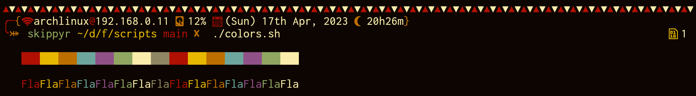

<h1>Flamerial</h1>
	<h2>Starting Point</h2>
		
Flamerial is a low contrast dark color palette with an old feeling. It is available for a few softwares.

		
		
In the image, Flamerial was used on <a href="https://github.com/kovidgoyal/kitty">Kitty</a> with <a href="https://github.com/skippyr/river_dreams">River Dreams</a> ZSH theme and <a href="https://fonts.google.com/specimen/Inconsolata">Inconsolata</a> font.

		
It is heavily inspired by these other amazing color palettes:

			<ul>
				<li><a href="https://github.com/morhetz/gruvbox">Gruvbox Dark</a></li>
				<li>Twilight</li>
				<li>Solarized Dark</li>
				<li><a href="https://github.com/rose-pine">Rosé Pine Dark</a></li>
				<li><a href="https://github.com/metalelf0/base16-black-metal-scheme">Black Metal</a></li>
			</ul>
		
If was not for them to exist, probably Flamerial would not be here.

	<h2>Palette</h2>
		<table>
			<thead>
				<tr>
					<td>Name</td>
					<td>Hex</td>
					<td>Preview</td>
				</tr>
			</thead>
			<tbody>
				<tr>
					<td>black</td>
					<td>#0d0501</td>
					<td></td>
				</tr>
				<tr>
					<td>green</td>
					<td>#e6b800</td>
					<td></td>
				</tr>
				<tr>
					<td>magenta</td>
					<td>#8f5187</td>
					<td></td>
				</tr>
				<tr>
					<td>light_black</td>
					<td>#8f8763</td>
					<td></td>
				</tr>
				<tr>
					<td>white</td>
					<td>#faedac</td>
					<td></td>
				</tr>
				<tr>
					<td>red</td>
					<td>#b01002</td>
					<td></td>
				</tr>
				<tr>
					<td>cyan</td>
					<td>#91a761</td>
					<td></td>
				</tr>
				<tr>
					<td>blue</td>
					<td>#6ca69c</td>
					<td></td>
				</tr>
				<tr>
					<td>yellow</td>
					<td>#bd6f00</td>
					<td></td>
				</tr>
			</tbody>
		</table>
	<h2>Installation And Usage</h2>
		
For any installation, you must first download this repository to your machine.

		
If you have <code>git</code> installed, you can use it in the following command:

		<pre><code>git clone --depth 1 https://github.com/skippyr/flamerial</code></pre>
		
This command will clone this repository to a directory called <code>flamerial</code> in your current directory, but feel free to use any other directory you wish. The flag <code>--depth</code> with value <code>1</code> specifies to <code>git</code> that you just want to download the latest commit instead of the whole commit tree.

		
If you do not have <code>git</code> installed, you can refer to the page of the project on GitHub, click in the <code>Code</code> button on the top of the page, then on <code>Download ZIP</code>. This will download a ZIP file, you will just have to unzip it.

		
Now, follow the instructions to install it for your desired software.

		<h3>Kitty</h3>
			
Copy the file <code>kitty/flamerial.conf</code> to the directory <code>~/.config/kitty/themes</code>. You may have to create that directory first.

			<pre><code>mkdir -p ~/.config/kitty/themes</code></pre>
			<pre><code>mv ./kitty/flamerial.conf ~/.config/kitty/themes</code></pre>
			
If your version of Kitty has the <code>themes</code> kitten, you can apply the port using it. Just navigate to the <code>User</code> tab and apply it.

			<pre><code>kitty +kitten themes</code></pre>
			
If your version of Kitty does not have it or you could not run it, you can apply the port manually by adding an include rule in the file <code>~/.config/kitty/kitty.conf</code>.

			<pre><code>include ./themes/flamerial.conf</code></pre>
			
If you have used other color palettes in Kitty, you may have to comment or remove include rules inside that file that may be including other color palettes.

			
Remember to refresh your current of Kitty if you are already running it, and the palette should be set.

		<h3>Xresources</h3>
			
Use the X11 command <code>xrdb</code> to update X11's database with the colors that are in the file <code>xresources/flamerial.xrdb</code>.

			<pre><code>xrdb -merge ./xresources/flamerial.xrdb</code></pre>
			
The flag <code>-merge</code> specifies to X11 that you only want to merge those changes instead of replacing all of your current X11's settings.

			
Restart your X11 applications and the palette should be set.

			
Be aware that those changes are not persistent and will get reversed when you log back into the graphical environment. To make them persistent, you must use the same command as stated before in a script that is execute everytime you enter the graphical environment, like <code>~/.xinitrc</code>, for example. If that is your case, remember to use the full path to the file instead.

	<h2>Issues, Questions And Ideas</h2>
		
If you had an issue, has a question or has an idea to improve Flamerial, feel free to use the Issues tab on its page on GitHub, so I can help you and see what you come with.

	<h2>Contributing</h2>
		
Contributions are welcome to fix issues and to answer questions reported in the Issues tab.

		
If you want to implement your own version of Flamerial, I would highly appreciate if you do it in a fork. Just remember to include credits to the original work and its original license.

	<h2>License</h2>
		
Flamerial is released under the MIT License. You can refer to the license as the file <code><a href="https://github.com/skippyr/flamerial/blob/main/LICENSE">LICENSE</a></code> in the root directory of this repository.

		
Copyright (c) 2023, Sherman Rofeman. MIT License.

