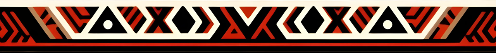
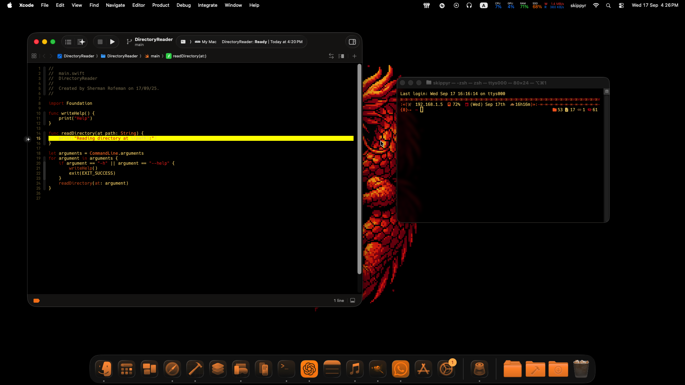
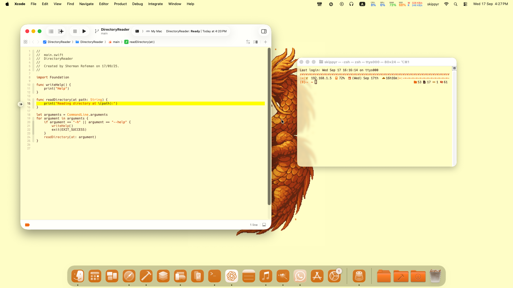
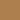
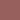
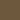
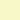

  

  

  <h1>≥v≥v&ensp;Flamerial&ensp;≥v≥v</h1>
  
⠋⠇⠁⠍⠑⠗⠊⠁⠇

<strong>Developer Tools</strong>&ensp;·&ensp;<em>Available for macOS</em> Since November 2022

> [!IMPORTANT]
> **Deprecation Notice**
>
> This was one of the first project that showed me I had the potential to build something meaningful—something other people could genuinely use—and taught me a lot through the mistakes I made along the way.
>
> Over time, though, I realized I couldn't continue maintaining it as my focus shifted toward becoming a macOS engineer.
>
> To carry its ideas forward, I've built a new theme called [Amber](https://gitlab.com/skippyr/Amber). If you're able, I encourage you to migrate to it.

## ❡ About
A fiery color palette for the sleek pony developers who are creating the foundation of their software empire through hard work and determination. Designed to work gracefully with Liquid Glass, it is available for Xcode and Terminal on the new macOS 26 Tahoe.

  
  

<strong>Caption:</strong> the Flamerial palette applied on macOS Tahoe.

### Palette
The colors that compose each variant are:

  <table>
    <thead>
      <tr>
        <th>Name</th>
        <th>Dark</th>
        <th>Light</th>
      </tr>
    </thead>
    <tbody>
      <tr>
        <td>Void</td>
        <td>&ensp;000000 (0, 0, 0)</td>
        <td>&ensp;4F2926 (79, 41, 38)</td>
      </tr>
      <tr>
        <td>Cherry</td>
        <td>&ensp;C41917 (196, 25, 23)</td>
        <td>&ensp;D14106 (209, 65, 6)</td>
      </tr>
      <tr>
        <td>Garnet</td>
        <td>&ensp;870F00 (135, 15, 0)</td>
        <td>&ensp;A32C00 (163, 44, 0)</td>
      </tr>
      <tr>
        <td>Amber</td>
        <td>&ensp;F26725 (242, 103, 37)</td>
        <td>&ensp;F27F1B (242, 127, 27)</td>
      </tr>
      <tr>
        <td>Cider</td>
        <td>&ensp;AD7E4E (173, 126, 78)</td>
        <td>&ensp;BB780E (187, 120, 78)</td>
      </tr>
      <tr>
        <td>Caramel</td>
        <td>&ensp;AA4118 (170, 65, 24)</td>
        <td>&ensp;B8582D (184, 88, 45)</td>
      </tr>
      <tr>
        <td>Coffee</td>
        <td>&ensp;78423B (120, 66, 59)</td>
        <td>&ensp;955F5C (149, 85, 92)</td>
      </tr>
      <tr>
        <td>Cream</td>
        <td>&ensp;E4C260 (228, 194, 96)</td>
        <td>&ensp;FFFDD1 (255, 253, 209)</td>
      </tr>
      <tr>
        <td>Almond</td>
        <td>&ensp;6F5840 (111, 88, 64)</td>
        <td>&ensp;AB8961 (171, 137, 97)</td>
      </tr>
      <tr>
        <td>Butter</td>
        <td>&ensp;FFFF00 (255, 255, 0)</td>
        <td>&ensp;FFFF00 (255, 255, 0)</td>
      </tr>
      <tr>
        <td>Trail</td>
        <td>&ensp;19110A (25, 17, 10)</td>
        <td>&ensp;F8F8C8 (248, 248, 200)</td>
      </tr>
    </tbody>
  </table>
  
<strong>Caption:</strong> the colors that compose the Flamerial palette.

## ❡ Install
### Dependencies
The software requires:
- macOS 26 Tahoe.
- Xcode 26.
- Terminal 2.15.

### Procedures
Follow this step-by-step to install the software:
- [Download the `Flamerial.zip` archive](https://github.com/skippyr/Flamerial/releases/latest/download/Flamerial.zip) from the latest release.
- In Finder:
  - Navigate to your Downloads folder.
  - Extract the archive by double left clicking it.
  - Access the extracted folder.
  - Copy the fonts from `Resources/Fonts` to `~/Library/Fonts`.
  - Copy the Xcode themes from `Themes/Xcode` to `~/Library/Developer/Xcode/UserData/FontAndColorThemes`.
> [!TIP]
>
> Use <kbd>⇧ Shift</kbd> <kbd>⌘ Cmd</kbd> <kbd>.</kbd> to show hidden entries in Finder such as your `Library` folder.
- In Terminal:
  - Open its settings using <kbd>⌘ Cmd</kbd> <kbd>,</kbd>.
  - Navigate to the `Profiles > Text` tab.
  - Left click on the `(...)` button below the sidebar.
  - Left click on the `Import...` option in the floating menu.
  - For each theme under `Themes/Terminal`, import it.
  - Select the preferred variant from the sidebar.
  - Left click on the `Default` button below the sidebar.
  - Reopen Terminal.
- In Xcode:
  - Restart Xcode if already open.
  - Open its settings using <kbd>⌘ Cmd</kbd> <kbd>,</kbd>.
  - Navigate to the `Themes` section.
  - Select the preferred variant from the `Theme` dropdown on top.
  - Switch its appearance under the `General` section and select the other variant from the same dropdown to set both a dark and light theme.
- In Photos:
  - Import the wallpapers from `Resources/Images/Wallpapers` to your library.
- In System Settings:
  - Navigate to the `Appearance` section.
  - Select the `Orange` accent color under `Color` section and `Tinted Auto` icons under `Icon & widget style`.
  - Navigate to the `Wallpaper` section.
  - Left click on the `Add Photo...` button.
  - Left click on the `Choose from Photos...` option in the floating menu.
  - For each wallpaper previously imported, select it.
  - Select the preferred wallpaper variant.
  - Toggle on the `Show on all Spaces` toggler on top.
> [!TIP]
>
> Add the `Dark Mode` widget to your menu bar or Control Center to easily switch between dark and light modes.

## ❡ Support
If you need help related to this software — whether to report an issue or suggest an improvement — please [send me an e-mail](mailto:skippyr.developer@icloud.com).

## ❡ Copyright
This software is under the Apache 2.0-License. See the `LICENSE` file within its source code for license details.

&ensp;

  
<em>In the memory of all fellow dragons, as the dreams that keep our flames alive.</em>

  
– ❤️‍🔥🐉 – <strong>≥v≥v&ensp;Here Be Dragons!&ensp;≥v≥</strong> Made with love by 🍒 <a href="https://github.com/skippyr">skippyr</a>

