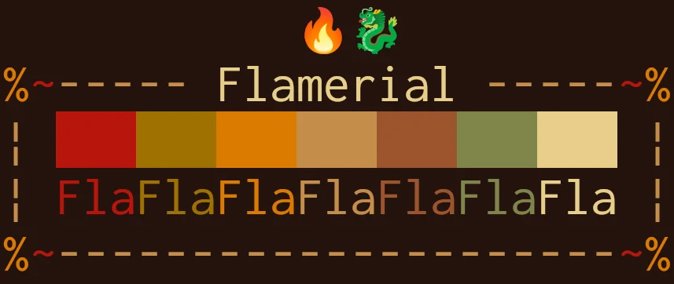

  

<h1 align="center">≥v≥v&ensp;flamerial&ensp;≥v≥v</h1>

  
  &nbsp;
  
  &nbsp;
  
  &nbsp;
  

<h2>❡ About</h2>

A 3-bits fiery dark color scheme.

  

<h2>❡ Install</h2>

Most of the available ports are under the <code>ports</code> directory. Access it, find one you would like to install, then read the <code>README.md</code> inside of it for instructions.

The remaining ports require exclusive repositories for their contents and instructions, you can visit them for more info. Those are:

<ul>
  <li><strong><a href="https://github.com/skippyr/flamerial.vim">flamerial.vim</a></strong>: the port for vim/neovim.</li>
</ul>
<h2>❡ Pallete</h2>
<table align="center">
  <thead>
    <tr>
      <th>ANSI</th>
      <th>Name</th>
      <th>HEX</th>
    </tr>
  </thead>
  <tbody>
    <tr>
      <td>0</td>
      <td>Black</td>
      <td><code>#24130e</code></td>
    </tr>
    <tr>
      <td>1</td>
      <td>Red</td>
      <td><code>#b8150d</code></td>
    </tr>
    <tr>
      <td>2</td>
      <td>Green</td>
      <td><code>#9e7100</code></td>
    </tr>
    <tr>
      <td>3</td>
      <td>Yellow</td>
      <td><code>#db7a00</code></td>
    </tr>
    <tr>
      <td>4</td>
      <td>Blue</td>
      <td><code>#c48d49</code></td>
    </tr>
    <tr>
      <td>5</td>
      <td>Magenta</td>
      <td><code>#9c542d</code></td>
    </tr>
    <tr>
      <td>6</td>
      <td>Cyan</td>
      <td><code>#80854b</code></td>
    </tr>
    <tr>
      <td>7</td>
      <td>White</td>
      <td><code>#e8cf89</code></td>
    </tr>
  </tbody>
</table>

<strong>Caption:</strong> the colors used in the flamerial color scheme with their respective ANSI values.

<h2>❡ Help</h2>

If you need help related to this project, open a new issue in its <a href="https://github.com/skippyr/flamerial/issues">issues page</a> or send me an <a href="mailto:skippyr.developer@gmail.com">e-mail</a> describing what is going on.

<h2>❡ Contributing</h2>

This project is open to review and possibly accept contributions, specially fixes and suggestions. If you are interested, send your contribution to its <a href="https://github.com/skippyr/flamerial/pulls">pull requests page</a> or to my <a href="mailto:skippyr.developer@gmail.com">e-mail</a>.

<a>By contributing to this project, you must agree to license your work under the same license that the project uses.</a>
<h2>❡ License</h2>

This project is licensed under the MIT License. Refer to the <code>LICENSE</code> file that comes in its source code for license and copyright details.

&ensp;

<strong>≥v≥v&ensp;Here Are Dragons!&ensp;≥v≥</strong> Made with love by skippyr <3
